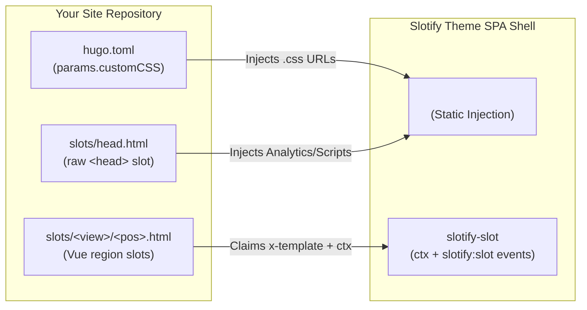

# Slotify Theme for Hugo 🚀

Slotify is an ultra-modern, **Single Page Application (SPA)** Hugo theme built with Vue.js and Vuetify. It delivers a premium visual experience, fluid page transitions, and robust full-site navigation without page reloads.

## ✨ Core Features

*   **⚡ True SPA Experience**: Intercepts all internal links via Vue Router and asynchronously loads Hugo-generated JSON data using the Fetch API, achieving seamless, flicker-free page transitions.
*   **🔀 Dual Pagination Modes**: One `paginationMode` switch picks how the home feed and taxonomy lists paginate. **`client`** (default) ships the whole feed once and slices it in-memory — instant, fetch-free page changes, ideal for personal blogs. **`static`** uses Hugo's build-time paginator: every `/page/N/` is a real, crawlable, deep-linkable document the SPA navigates between — smaller payloads that scale to large blogs. See the [`paginationMode` config](#using-in-your-project) below and **the "Pagination modes" section** for the full walkthrough.
*   **💎 Antigravity Premium Design**:
    *   **Typography**: Utilizes [Inter](https://fonts.google.com/specimen/Inter) for body text and [Outfit](https://fonts.google.com/specimen/Outfit) for headings, creating a modern and high-end reading experience.
    *   **Glassmorphism**: Elegant blur background effects (`backdrop-filter`) applied to the App Bar and Footer.
    *   **Micro-animations**: Features interactive float effects (`hover-lift`) on article cards and smooth entry animations (`fade-up`) on page load.
*   **🌐 Internationalization (i18n)**: Built-in custom i18n module. All UI text is translatable, and user language preferences are persisted in `localStorage`.
*   **🎨 Multiple Theme Personalities**: Includes various curated color schemes (Vibrant, Sunset, Forest, Ocean, Nordic, Espresso) along with full Light/Dark mode support.
*   **📊 Mermaid Diagram Theming**: Mermaid diagrams rendered inside Markdown automatically sync their colors to the active theme personality and light/dark mode—no per-diagram `%%{init}%%` directives required.
*   **🏷️ Dynamic Tag Cloud**: Automatically calculates the weight of Tags and Series based on post count, dynamically adjusting their visual size and color.
*   **🧩 Slotify Slots (Extensibility)**: Path-addressed, overridable mount points across the theme. Customize any region — side rails, hero, footer, comments, `<head>` — **entirely from your site root, never forking the theme**. Each Vue slot gets site-data `ctx`, a `slotify:slot` lifecycle event (SPA-safe Disqus/Giscus), and self-contained namespaced i18n — no JavaScript build step.
*   **🖼️ Rich Media Support**: Seamlessly supports dedicated "Featured Images" for posts and high-end rendering (rounded corners, soft shadows, responsive scaling) for standard Markdown embedded images.

---

## 🛠️ Installation & Configuration

As a standard Hugo theme, Slotify separates theme logic from your site's content. We have provided an `exampleSite` directory to demonstrate how a working project is structured.

### The `exampleSite` Showcase
The `exampleSite` directory is Slotify's live feature showcase — it exercises every theme feature, UI component, and Markdown style, so it doubles as a working reference while you build your own site.

### Running the Example Site
To test the theme locally and explore the feature showcase:
1. Navigate to the `exampleSite` directory:
   ```bash
   cd exampleSite
   ```
2. Run the Hugo server. You MUST explicitly tell it where to find the theme:
   ```bash
   hugo server --themesDir ../..
   ```

### Browser Smoke Tests (optional)
The Hugo build and the `exampleSite` JSON validators can't see runtime SPA
behaviour (module loading, client-side routing, slot hydration, Mermaid,
code-copy). A minimal [Playwright](https://playwright.dev) suite covers that.
It requires Node (not otherwise needed to use the theme):
```bash
npm install
npx playwright install chromium
npm test                 # boots `hugo server` on :1313 and drives Chromium
```
The webServer command in `playwright.config.js` mirrors `--themesDir ../..`.

### Using in Your Project
When installing this theme in your own Hugo project, your root `hugo.toml` **MUST** include the following output formats. Every Kind emits **both HTML and JSON**: the HTML is the real per-URL document (so deep links return a direct 200 and crawlers/SEO work), and the JSON is the SPA's data source for client-side navigation. (Disabling HTML for any Kind breaks deep-linking and SEO for it.)

```toml
theme = 'slotify'

[params]
  # All theme params, their values and defaults are in the "Theme Parameters"
  # table below; all are optional. The values shown here are illustrative.
  ogImage          = "/images/og-cover.png"  # social/SEO preview image
  pagerSize        = 5                        # feed page size (default 10)
  paginationMode   = "client"                 # "client" | "static"
  defaultColorMode = "light"                  # "light" | "dark" | "auto"
  # scriptBundle   = "js/slotify.bundle.js"   # opt-in single-bundle SPA entry

# Every Kind outputs HTML (per-URL document for deep-links/SEO) + JSON (SPA data).
[outputs]
  taxonomy = ['HTML', 'JSON']
  term     = ['HTML', 'JSON']
  home     = ['HTML', 'JSON', 'SEARCHINDEX']
  page     = ['HTML', 'JSON']
  section  = ['HTML', 'JSON']

# Define Social Links (Used by the custom footer injection)
[params.social]
  github = "https://github.com/your-username"
  twitter = "https://twitter.com/your-username"
  linkedin = "https://linkedin.com/your-username"
  facebook = "" # Keys with empty strings will be automatically hidden

# Comments (optional) — provider-agnostic via Slotify Slots. The exampleSite
# demo ships Giscus ([params.giscus]); Disqus is an alternative. Either way you
# also override layouts/partials/slots/postView/bottom.html in your site — see
# the Comments section below for both ready-to-copy partials.
[params.disqus]
  shortname = "your-disqus-shortname"
  scope = ["/posts/"]   # optional: defaults to ["/posts/"] if omitted

# Markup Renderer (optional) — enable only if your Markdown uses raw HTML
# The theme defaults to Hugo's safe renderer (unsafe = false).
[markup]
  [markup.goldmark]
    [markup.goldmark.renderer]
      unsafe = true
```

#### Theme Parameters

Set under `[params]`; all are optional and these are the defaults. This table is the reference — the theme's own `hugo.toml` and `exampleSite` only carry the values.

| Param | Values (default) | What it does |
|---|---|---|
| `ogImage` | URL — *(unset)* | Social/SEO preview image; sets `og:image` and a `summary_large_image` Twitter card. Falls back to a plain summary card when unset. |
| `pagerSize` | int — `10` | Cards per page for the home feed and taxonomy-term lists, in both pagination modes. |
| `paginationMode` | `client` *(default)* · `static` | `client` ships the whole feed and slices it in-memory (instant page changes, no `/page/N/` URLs); `static` uses Hugo's build-time paginator — a real HTML+JSON document per `/page/N/` the SPA navigates between (crawlable, deep-linkable, scales to large blogs). |
| `defaultColorMode` | `light` *(default)* · `dark` · `auto` | Colour mode for a first-time visitor; `auto` follows the OS `prefers-color-scheme`. A stored user choice always wins. |
| `scriptBundle` | path or URL — *(unset)* | Boot the SPA from one prebuilt bundle instead of the default ES-module graph. Opt-in; the theme ships no bundler. Deep dive: **Bundling & Vendor** below. |

The default **personality** is not a param — it is the first key of the palette, so reorder `data/theme-palette.json` (or `[params.palette]`) to change it.

> **Alternative: Override the JSON layout in your own site**
>
> Since the SPA fetches each page's content as JSON (the `*.json` outputs, alongside the per-URL HTML), you MAY control what that payload includes by overriding the theme's `layouts/_default/single.json` in your own site. Your site's layouts always take priority over the theme:
>
> Create `layouts/_default/single.json` in your own site root:
> ```
> {{- dict "title" .Title "content" .Content "date" (.Date.Format "2006-01-02") | jsonify (dict "indent" "  " "noHTMLEscape" true) -}}
> ```
> The theme default intentionally uses Hugo `jsonify` without `noHTMLEscape`, so HTML characters are safely encoded in the JSON payload and restored by the browser's JSON parser before Vue renders the content. Use `noHTMLEscape: true` only when you explicitly need verbatim HTML characters in the generated JSON and have documented that choice.
>
> The `unsafe` flag in your `hugo.toml` controls whether raw HTML blocks in Markdown are included in `.Content` at all. `noHTMLEscape` only affects how the JSON encodes what is already in `.Content`.

---

## ✍️ Writing Guideline (Code-as-Doc)

To accelerate your content creation, we provide a definitive "Code-as-Doc" template. 

👉 **[View and Copy the WRITING-TEMPLATE.md](./WRITING-TEMPLATE.md)**

You MAY simply copy the contents of this template into your `content/posts/` directory whenever you create a new article. It includes the standard Front Matter format and examples of how Slotify renders Markdown elements.

### Front Matter Properties

Every article placed in `content/posts/` supports the following Front Matter attributes:

```toml
+++
title = 'Your Post Title'
date = 2023-10-27T10:00:00+08:00
draft = false
tags = ['Tag1', 'Tag2']
series = ['Series Name']
# Featured Image (Optional): Displayed on the homepage card and as a hero image in the post
image = 'https://example.com/cover.jpg'
+++
```

### Embedded Images & Media

You MAY freely embed images within your Markdown content using standard syntax. `slotify.css` automatically optimizes these images for a premium look:

```markdown

```

**Visual Enhancements for Embedded Images:**
*   Automatically scales to fit the screen without overflowing (`max-width: 100%`).
*   Features premium `16px` rounded corners.
*   Includes a refined, soft bottom shadow (`box-shadow`) to create depth.
*   Automatically maintains comfortable spacing from surrounding text for optimal readability.

---

## 🎨 Quick Customization

Slotify provides the following structured personalization points:

- **Change Theme Colors (and how many)**: The palette in `data/theme-palette.json` is the single source of truth for every personality's colors (`background`, `surface`, `primary`, `secondary` per Light/Dark) **and for which personalities exist + their order**. A consuming site recolors, reorders, adds, or removes personalities entirely from `hugo.toml` `[params.palette]` (deep-merged) — no fork, never touching `themes.js` or templates. The default personality is just the first one. (Structural tokens like radius/shadow live in `static/css/slotify.css` `:root`.) See the documentation below. Recoloring is your accessibility to own — self-check with `python3 .agent/scripts/check-palette-a11y.py`.
- **Rename / re-icon / localize the switcher**: A personality's display name (per language) and icon are owned by the `appHeader` slot, not core. Override `layouts/partials/slots/appHeader.html` and edit its `styles.<id> = { name, icon }` i18n block — names follow the live language switch. See the documentation below.
- **Add / change languages**: The locale set lives in `data/locales.json` (ordered `{ code, label }`; first = default). A consuming site declares its own languages via `[[params.locales]]` in `hugo.toml` and drops a matching `static/js/i18n/<code>.json` — no fork. The persisted choice is the `code`, so order only sets the switcher's cycle. Self-check key parity with `python3 .agent/scripts/check-i18n-parity.py`. See the documentation below.
- **Change Logo/Title**: Update `title` in your `hugo.toml`. The SPA will automatically pick it up.
- **Navigation**: The default header/drawer show a **curated** set of links (Home, Series, Tags, About) defined in `static/js/config/routes.js` (`navigationItems`) — each carries an icon and a translatable label, which is why the set is theme-owned rather than auto-built from `[[menus.main]]`. To change the header links without forking, **override the `appHeader` slot** and build your own nav from `ctx.siteConfig.menu` (Hugo populates it from your `[[menus.main]]`, and it is already injected for you). See the Slotify Slots section below.
- **Custom CSS**: MAY inject your own stylesheets by adding them to the `customCSS` array in `[params]` within `hugo.toml`.
- **Slotify Slots** — override any region from your site root (never the theme):
    - `layouts/partials/slots/head.html`: static document `<head>` injection (Analytics, fonts, meta).
    - `layouts/partials/slots/appHeader.html`: the visual header / nav bar (default mounts the theme's `<app-header>`).
    - `layouts/partials/slots/home/banner.html`: a fully custom home hero banner.
    - `layouts/partials/slots/footer.html`: the footer (default = site title + copyright).
    - `layouts/partials/slots/<view>/{left,right,top,bottom}.html`: directional content slots for `postView` / `aboutView` (and `left`/`right` for `homeView`). Each Vue slot gets a `ctx` (site data), namespaced i18n, and a `slotify:slot` lifecycle event.
    See the **Extending the Theme — Slotify Slots** section below for the full model.

### Hybrid Injection Architecture
The theme provides safe, high-flexibility override points without touching the core code. It leverages a "Macro + Micro" injection strategy where Hugo prepares the static shell and Vue.js dynamically "claims" templates and emits events for custom logic.



---

## 8. Comments (Giscus / Disqus)

Comments are **not built into the theme core** — they are the default home of the `postView/bottom` slot (§4), which ships empty so the engine stays provider-agnostic ("Theme Core Cleanliness"). Enabling them is a **two-step, site-root-only** recipe — the theme directory is never edited:

1. **Add the provider config** to `hugo.toml` (e.g. `[params.giscus]` or `[params.disqus]`).
2. **Drop one override file** at `layouts/partials/slots/postView/bottom.html` in YOUR site — copy a reference below verbatim. Slotify's demo ships **Giscus**; `exampleSite/layouts/partials/slots/postView/bottom.html` is that live, working copy.

**How it works** (the slot contract — full details in §4.4): `<slotify-slot>` fires a `slotify:slot` window event (`detail = { id, phase, ctx, el }`) on mount/update/unmount; for this slot `id` is `Slotify.slots.postView.bottom` and `ctx` carries `{ pageData, pageIdentifier, siteConfig, route, theme, t }`. `PostView` is keyed by route → a fresh `mount` per article. The theme mounts the slot only on articles with `pageData.content`; your listener owns the opt-in (config present) and any `scope` path filter (default `["/posts/"]`). With nothing configured/overridden, zero external scripts load.

The demo's provider is **Giscus** (working copy: `exampleSite/layouts/partials/slots/postView/bottom.html`; reference below). A compact **Disqus** reference follows for **single-global-script** providers (Disqus/Utterances). ⚠️ **Crucial difference**: Disqus loads its `embed.js` **once per session** then calls `DISQUS.reset()` on navigation, whereas Giscus re-injects a fresh iframe per mount — copying the Giscus per-mount pattern for Disqus would double-load it. That non-obvious delta is exactly why this reference is kept.

#### Giscus reference (the demo's provider — GitHub Discussions, privacy-friendly)
The working copy shipped at `exampleSite/layouts/partials/slots/postView/bottom.html`. After enabling [giscus.app](https://giscus.app) on your repo, copy its `data-*` values into `[params.giscus]`, then drop this into your site's `layouts/partials/slots/postView/bottom.html`:

```toml
[params.giscus]
  repo        = "owner/repo"
  repoId      = "R_xxxxxxxx"
  category    = "Announcements"
  categoryId  = "DIC_xxxxxxxx"
  mapping     = "pathname"   # optional, defaults to pathname
```

```html
<!-- Slot-scoped i18n (§12): the heading lives WITH the slot, ctx.t resolves it. -->
<script type="application/json" data-slotify-i18n="Slotify.slots.postView.bottom">
{ "en": { "title": "Comments" }, "zh": { "title": "討論" } }
</script>

<script type="text/x-template" id="slot-postView-bottom-template">
  <!-- Surface-first: wrap the thread in the theme's glass card via documented CSS
       (glass-panel + --radius-lg), NOT the BaseSurface component (not slot-registered).
       The <h2> gives the discussion its own section heading + outline landmark.
       The Vue mustache is Hugo-escaped so Hugo emits {{ ctx.t('title') }} for Vue. -->
  <div class="mt-12 glass-panel pa-6 pa-sm-8" style="border-radius: var(--radius-lg);">
    <h2 class="text-h6 font-weight-bold mb-3">{{ "{{" }} ctx.t('title') {{ "}}" }}</h2>
    <v-divider class="mb-6"></v-divider>
    <div class="giscus"></div>
  </div>
</script>
<script>
  (() => {
    const repo = '{{ site.Params.giscus.repo | default "" }}';

    // Slotify mode -> giscus theme. `noborder_*` drops giscus's own frame so it
    // sits cleanly inside the glass card (no double border).
    const giscusTheme = (mode) => mode === 'dark' ? 'noborder_dark' : 'noborder_light';

    // Live re-theme the loaded iframe via giscus's setConfig postMessage. The
    // mode comes from the slotify:theme event's semantic { mode } — no DOM class
    // or Vuetify peeking (that's gated; use the contract).
    window.addEventListener('slotify:theme', (event) => {
      const frame = document.querySelector('iframe.giscus-frame');
      if (!frame || !frame.contentWindow) return;
      frame.contentWindow.postMessage(
        { giscus: { setConfig: { theme: giscusTheme(event.detail.mode) } } }, 'https://giscus.app'
      );
    });

    window.addEventListener('slotify:slot', (event) => {
      const { id, phase, ctx, el } = event.detail;
      if (id !== 'Slotify.slots.postView.bottom') return;
      if (phase !== 'mount') return;                       // fresh container per route (keyed remount)
      if (!repo) return;                                   // opt-in guard, mirrors Disqus shortname
      const mount = el && el.querySelector('.giscus');
      if (!mount || mount.querySelector('iframe, script')) return;  // never double-inject

      // No readiness gate needed: ctx is complete at mount (siteConfig is injected,
      // not fetched), and pageIdentity is in ctx. slotify:ready is for GLOBAL widgets.
      const s = document.createElement('script');          // giscus renders its iframe INTO this container
      s.src = 'https://giscus.app/client.js';
      s.async = true;
      s.crossOrigin = 'anonymous';
      s.setAttribute('data-repo', repo);
      s.setAttribute('data-repo-id', '{{ site.Params.giscus.repoId }}');
      s.setAttribute('data-category', '{{ site.Params.giscus.category }}');
      s.setAttribute('data-category-id', '{{ site.Params.giscus.categoryId }}');
      s.setAttribute('data-mapping', '{{ site.Params.giscus.mapping | default "pathname" }}');
      s.setAttribute('data-strict', '1');
      s.setAttribute('data-reactions-enabled', '1');
      s.setAttribute('data-theme', giscusTheme((ctx.theme && ctx.theme.mode) || 'light'));  // initial; slotify:theme keeps it synced
      mount.appendChild(s);
    });
  })();
</script>
```

> **Why no `injected`-once guard (unlike Disqus).** `PostView` is keyed by route, so each navigation **remounts** the slot with a brand-new empty `.giscus` container — injecting a fresh `client.js` per `mount` is correct and leaves no stale iframe. The `querySelector('iframe, script')` check only guards against a double `mount` for the *same* container. (Disqus differs: it loads ONE global `embed.js` and calls `DISQUS.reset()` thereafter, which is why it needs the session-level `injected` flag.)

> **Surface + light/dark via the contract (no framework peeking).** The thread sits in the theme's glass card (`glass-panel` + `--radius-lg`) so it matches the article surface above (SKILL §7). giscus won't re-theme its iframe on its own, so the slot takes its INITIAL mode from `ctx.theme.mode` and live-syncs on the `slotify:theme` event the slot bridge broadcasts (§4.4) — mapping mode to giscus's `noborder_*` themes (cleanest inside the card) and posting `setConfig` to the live iframe. Never watches Vuetify's `v-theme--*` class (gated). Entirely in your override partial, theme core untouched.

#### Disqus reference (single-global-script providers)
Configure `[params.disqus]` (`shortname`, optional `scope = ["/posts/"]`), then drop this into your site's `layouts/partials/slots/postView/bottom.html`:

```html
<script type="text/x-template" id="slot-postView-bottom-template">
  <div class="mt-12 pt-6"><div id="disqus_thread"></div></div>
</script>
<script>
  (() => {
    let injected = false;                                        // embed.js loads once per session
    window.addEventListener('slotify:slot', (event) => {
      const { id, phase, ctx, el } = event.detail;
      if (id !== 'Slotify.slots.postView.bottom') return;        // only this slot
      if (phase !== 'mount') return;                             // (re)init on a fresh mount only
      const shortname = '{{ site.Params.disqus.shortname | default "" }}';
      if (!shortname) return;
      window.disqus_config = function () {                       // latest page wins
        this.page.identifier = ctx.pageIdentifier;               // from slot ctx
        this.page.url = window.location.href;
      };
      if (window.DISQUS) {                                       // re-init on navigation
        window.DISQUS.reset({ reload: true, config: window.disqus_config });
        return;
      }
      if (injected) return;                                      // load already in flight
      injected = true;
      const s = document.createElement('script');               // first load
      s.src = `https://${shortname}.disqus.com/embed.js`;
      s.async = true;
      s.onerror = () => { injected = false; };                  // allow retry on failure
      document.head.appendChild(s);
    });
  })();
</script>
```

> **Why load-once + `DISQUS.reset()`.** Client-side navigation never reloads the page, so `embed.js` must load exactly once (re-injecting double-loads Disqus); after that, `DISQUS.reset()` re-targets the new thread. `ctx.pageIdentifier` is the post's permalink (default scope `["/posts/"]`); set `scope` if your `permalinks` move posts elsewhere. A production override should also hide the slot wrapper (via `el`) on out-of-scope posts — the Giscus copy above does this.

---


## 4. Extending the Theme — Slotify Slots

Customize **any** region of the theme **entirely from your site root** — the theme directory is never edited or forked. Three surfaces: `customCSS`, the raw `<head>` slot, and the path-addressed **Slotify Slots** system. (Mirrored for agents in SKILL §13.)

### 4.1. `customCSS` (Simple Stylesheet Injection)
Place your `.css` in your site's `static/css/` and link it via `hugo.toml`:
```toml
[params]
  customCSS = ["/css/my-custom-style.css"]
```

### 4.2. Slots — the model
A slot is a named, overridable mount point addressed by its file path:
- **File**: `layouts/partials/slots/<view>/<position>.html`
- **Namespace/id**: `Slotify.slots.<view>.<position>`
- **Override**: place the SAME path in *your* site's `layouts/partials/slots/…` (standard Hugo partial override). The theme ships an empty default; your file replaces it.

Supported positions (the directional matrix; left/right are the side rails, top/bottom are anchored above/below the content card `BaseSurface`):

| View | left | right | top | bottom |
|---|:---:|:---:|:---:|:---:|
| `postView` (single post/page) | ✓ *Series Nav (default)* | ✓ *Table of Contents (default)* | ✓ | ✓ *comments* |
| `aboutView` | ✓ | ✓ | ✓ | ✓ |
| `homeView` | ✓ | ✓ | — | — |
| `taxonomyView` (tags/series) | ✓ | ✓ | — | — |
| `searchView` | ✓ | ✓ | — | — |

A **side rail appears only when you give its slot real markup** — empty rail defaults keep the page's original column width. Plus the **named global slots** (all with complete, overridable defaults): `slots/head.html` (raw `<head>` injection — analytics/meta/fonts; distinct from the visual header), `slots/appHeader.html` (the visual header / nav bar — default mounts the theme's `<app-header>`, forwarding theme/language/drawer controls via `ctx`), `slots/footer.html` (app footer — default = site title + copyright), `slots/home/banner.html` (home hero). Component-backed defaults (`appHeader`, `postView/left` = Series Nav, `postView/right` = ToC) follow the same rule: the theme's real component IS the default; overriding the slot replaces it.

### 4.3. Anatomy of a slot override
Your override partial may contain up to three parts. Inside the x-template, `ctx` exposes `{ siteConfig, route, t, …local }` (local vars vary by slot, e.g. `pageData`, `pageIdentifier`).

```html
<!-- 2) Optional: this slot's own i18n, registered under its namespace -->
<script type="application/json" data-slotify-i18n="Slotify.slots.footer">
{ "en": { "madeWith": "Made with Slotify" }, "zh": { "madeWith": "以 Slotify 打造" } }
</script>

<!-- 1) Required: the markup. Use ctx.t('key') for namespaced strings -->
<script type="text/x-template" id="slot-footer-template">
  <div class="text-caption opacity-60">{{ "{{" }} ctx.t('madeWith') {{ "}}" }}</div>
</script>
```
Switching UI language re-renders `ctx.t(...)` automatically. The id MUST be `slot-<view>-<position>-template` (slashes → dashes).

### 4.4. Slot events — the ambient-state contract (SPA-safe third-party widgets)
A slot override is plain HTML + `<script>` with **no Vue/Vuetify access**. So that an imperative widget (comments, analytics, ads) can still react to app state without a page reload — and without reaching into framework internals — the theme exposes ambient state two ways:

- **`ctx`** (for the INITIAL value, and for declarative re-rendering): every slot receives `ctx = { siteConfig, route, theme, t, …local }`. `ctx.siteConfig` (title/social/menu) is **injected by Hugo at build time** (`window.__SLOTIFY_SITE__`), so it is fully populated from the very first mount — no async hydration, even on a direct deep-link. `ctx.theme` is `{ name, personality, mode }` (`mode` is `'light'`/`'dark'`); `ctx.t` re-renders on language change. This is a **semantic** snapshot — never the `v-theme--*` class or a Vuetify object. Its shape is documented as a stable contract (`@typedef SlotifySlotCtx` in `static/js/utils/slotCtx.js`); `siteConfig`/`route`/`theme`/`t` are **reserved** — a mount site's local ctx is merged *under* them and cannot override them (gated by `verify-slot-ctx.py`). Because `ctx` is a snapshot at dispatch, read INITIAL state from it but react to CHANGES via the events below.
- **`slotify:*` window events** (for CHANGES after mount): one relayer — `static/js/composables/useSlotBridge.js` — `watch`es the reactive sources and re-broadcasts each change, so emission lives in ONE auditable place (not scattered across setters):

| Event | `detail` | Fires on |
|---|---|---|
| `slotify:slot` | `{ id, phase, ctx, el }`, `phase` ∈ `mount\|update\|unmount` | a slot mounts / its local ctx updates / unmounts |
| `slotify:theme` | `{ name, personality, mode }` | personality or light/dark change |
| `slotify:locale` | `{ locale }` | UI-language change |
| `slotify:route` | `{ path, name }` | SPA navigation (for GLOBAL slots that don't remount) |
| `slotify:ready` | *(none)* | the SPA has mounted & is interactive (one-shot) — see below |

Add a plain `<script>` in your override partial that `addEventListener('slotify:theme', …)` etc. See §8 for a complete Giscus example that uses `ctx.theme.mode` for its initial theme and `slotify:theme` to live-sync the iframe — with zero DOM/Vuetify peeking. **Reaching into framework internals from a slot (`v-theme--*`, `useTheme`, `VueRouter`, `Vuetify.*`) is prohibited and gated by `verify-slot-isolation.py`** (SKILL §13) — use the contract above instead.

**`slotify:ready` — the "SPA is interactive" hook.** Because `ctx.siteConfig` is now injected at build time (synchronous), there is **no deep-link race** to defend against — a slot's first `slotify:slot` mount already carries complete `ctx`, so theme slots never need to wait. `slotify:ready` exists for a different audience: **your own / secondary-development widgets** (a global analytics bootstrap, a one-time third-party SDK init) that must run exactly once, after the SPA has mounted and taken over the DOM. It is a one-shot event backed by the idempotent flag `window.__SLOTIFY_READY__`, so it's race-proof whether your script runs before or after boot:
  ```js
  const whenReady = (fn) => {
    if (window.__SLOTIFY_READY__) fn();                              // already interactive
    else window.addEventListener('slotify:ready', fn, { once: true }); // run once it is
  };
  whenReady(() => { /* init your global widget / analytics here */ });
  ```
For **per-page** widgets (comments, per-post embeds) you do NOT need this — bind to your slot's `slotify:slot` mount and read `ctx.pageIdentifier` (the §8 Giscus reference does exactly that). For **SPA pageview tracking**, the first page load is a real HTML document (your `slots/head.html` analytics fires naturally); subsequent client-side navigations are signalled by `slotify:route`.

> [!NOTE]
> A new slot is added by the THEME (a new dummy partial + a `data/slots.json` entry + a `<slotify-slot>` mount, kept in lockstep by `verify-hooks.py`). Site owners do not add new slot *positions*; they **override** existing ones. The demo's social bar (`slots/aboutView/bottom.html`) and Giscus (`slots/postView/bottom.html`) are reference overrides in `exampleSite/layouts/partials/slots/`.

---

## 7. Content Organization & Directory Structure

To ensure the SPA theme renders your content correctly, you MUST follow these directory and naming conventions.

### The Mandatory `/posts/` Section

> [!IMPORTANT]
> The homepage article list (`home.json`) is currently hardcoded to fetch content from the `posts` section. 

- Your primary articles **MUST** be placed in `content/posts/`. 
- If you use a different directory name (e.g., `content/blog/`), the homepage list will be empty unless you modify `layouts/home.json`.

### Required Infrastructure Pages

Since this is an SPA, the theme requires specific "shell" pages to exist in your `content` directory for the search and about routes to function. After a clean install, you MUST copy these from the `exampleSite`:

1.  **Search Page**: Create `content/search/_index.md` with `layout: single`. This tells Hugo to generate the search index.
2.  **About Page**: Create `content/about.md`. This provides the data for the `/about` route.
3.  **Homepage Content**: Create `content/_index.md` to define the site-wide title and metadata for the home route.
4.  **Section Index**: Create `content/posts/_index.md` to define the metadata for the posts collection.

### Recommended: Page Bundles (Leaf Bundles)

As mentioned in §6, Slotify is optimized for **Hugo Page Bundles**. This is the cleanest way to manage post-specific images:

```text
content/
└── posts/
    └── my-sophisticated-post/
        ├── index.md       <-- The article
        ├── cover.jpg      <-- Referenced in front matter
        └── screenshot.png <-- Referenced in body
```

**Benefits:**
*   **Relative Paths**: Use `image = "cover.jpg"` in front matter.
*   **Portability**: Moving a post folder moves all its media.
*   **Cleanliness**: Your root `static/images` folder won't become a cluttered mess.

---

## 9. SPA Deployment Guidelines

Slotify emits a real per-URL HTML document for **every** route (see the `[outputs]` block in the README — every Kind outputs HTML + JSON). So a direct visit to a **known** deep link (e.g. `https://example.com/posts/my-post/`) returns a direct **200** with crawlable HTML, and the SPA hydrates over it — no SPA-rewrite needed for known routes. You only need a fallback for **genuinely unknown** URLs (a typo, or a purely client-side route with no Hugo content): send them to the SPA so it can show its own 404 view instead of the host's raw 404. The per-provider config below is exactly that fallback; static files always take precedence, so it never shadows the per-route HTML.

**1. GitHub Pages**
The theme implements a "Smart 404 Hack": GitHub Pages serves known routes' real HTML directly (200); for unknown URLs it serves `layouts/404.html`, whose redirect payload boots the SPA. Ensure `404.html` is present and deployed.

**2. Netlify**
Create a `static/_redirects` file with:
```
/*    /index.html   200
```
Netlify serves an existing per-route HTML file first; this rule only catches paths with **no** static file, booting the SPA for them (it does not replace known routes' HTML).

**3. Vercel**
Create a `vercel.json`:
```json
{
  "rewrites": [{ "source": "/(.*)", "destination": "/" }]
}
```
Vercel checks the filesystem before rewrites, so known routes still serve their own HTML; this only rewrites otherwise-unmatched paths to the SPA.

**4. Project pages — subpath (base awareness)**
A GitHub *project* site is served from a subpath: `https://<user>.github.io/<repo>/`. The build MUST set the base to that subpath, or assets and client fetches resolve against the wrong root and 404. The deploy workflow does this by passing Hugo `--baseURL "${{ steps.pages.outputs.base_url }}"` (supplied by `actions/configure-pages`); this also drives `window.__SLOTIFY_BASE__`, making the SPA router base-aware. The one contract the templates must honor under a subpath is the **base-less route-target rule** in §2.4 — every embedded `url` goes through `func/route-path.html`. Because each Kind also emits real per-route HTML (`hugo.toml [outputs]`), GitHub Pages serves deep links to *known* routes with a direct **200**; the `404.html` redirect above is the fallback for genuinely unknown URLs.

A **root** deployment needs none of this: a user/org site (`<user>.github.io`) or an apex custom domain has base `/`, so you can drop `--baseURL`, and `route-path.html` is a no-op. Either way, set the repo's *Settings → Pages → Source* to **GitHub Actions** so `configure-pages` can supply the base.

---

## 📦 Bundling & Vendor

### 10.1. Optional: bundling the SPA entry (`scriptBundle`)

The SPA boots from an ES-module graph (`js/main.js` and its imports) loaded as-is — **no build step**, which is the theme's standard and default. The app modules reference the vendor libraries (Vue, Vuetify, Vue Router) as globals loaded by the `data/vendor.json` classic-script loop, so the graph a bundler would see is the app's own modules plus a single bare ESM import (`fuse`, resolved by the import map — see § 10.2). On HTTP/2 the many small requests are cheap, but a site that prefers a single request can opt into bundling. This is a **capability, not a requirement**: the theme ships no bundler and mandates no toolchain.

The boot `<script>` is isolated in `layouts/partials/app-entry.html`, giving two opt-in routes:

*   **Prebuilt file** — bundle the app graph with any tool (esbuild, Rollup, or Hugo's own `js.Build`) to a single module at a fixed published path, then point the param at it:
    ```toml
    [params]
      scriptBundle = "js/slotify.bundle.js"   # published-root path, or an absolute URL
    ```
    `app-entry.html` emits that as the `type="module"` entry instead of `js/main.js`. An absolute URL passes through untouched (for a CDN); a root-relative path is run through `relURL` for sub-directory deploys.

*   **Hugo-native (zero external dependency)** — for a fully self-contained build, override `layouts/partials/app-entry.html` in your own site and bundle with Hugo's built-in esbuild, emitting the built resource's `.RelPermalink`:
    ```go-html-template
    {{- $opts := dict "minify" true "targetPath" "js/slotify.bundle.js" "externals" (slice "fuse") -}}
    {{- $bundle := resources.Get "js/main.js" | js.Build $opts | fingerprint -}}
    <script type="module" src="{{ $bundle.RelPermalink }}" integrity="{{ $bundle.Data.Integrity }}"></script>
    ```
    `js.Build` needs the app JS reachable through the assets pipeline, so add a mount in your site config — e.g. `[[module.mounts]] source = "themes/slotify/static/js"  target = "assets/js"`, adjusting the source for a Go-module install. Mark the bare specifier `fuse` (and any you add) as `externals` so it stays an `import` in the output and the runtime import map (§ 10.2) resolves it — no need to bundle the vendor file. This keeps the integrity/lockfile philosophy of § 10 intact: nothing is fetched at build, and the bundle is fingerprinted.

Either route is invisible to the rest of the theme — the bundle is a drop-in replacement for the `js/main.js` entry, so routing, slots, the import map, and the synchronous `window.__SLOTIFY_*` injects are unaffected.

Beyond collapsing requests, the same build step is the supported answer to the two things the no-build default trades away:

*   **Tree-shaking / smaller payload** — the default ships the full vendored Vue + Vuetify un-tree-shaken (the price of a zero-toolchain runtime). A bundler drops unused code, cutting the transfer and Time-to-Interactive — worth it on slow mobile connections as a feed grows. This is the escape hatch when a site outgrows the simplicity trade; the default deliberately optimizes for "no build step" over payload size.
*   **Older-browser support** — the native ESM + import-map floor is **Chrome/Edge 89+, Firefox 108+, Safari 16.4+** (see § 10.2; the theme is intentionally modern-evergreen and ships no polyfill). To go below that, bundle with a down-level `target` and/or add [`es-module-shims`](https://github.com/guybedford/es-module-shims) ahead of the import map. Compatibility is a deliberate, documented baseline, not an accident — and bundling is the way to widen it.

### 10.2. Swapping a vendored library

Vendor loading is driven by `data/vendor.json`, so swapping or version-bumping a library is a manifest change, never a template edit — there are no hardcoded vendor paths. Each entry has a `dest` (its path under `static/vendor/`) and one of two load modes:

*   **Classic globals** (Vuetify, Vue Router, Mermaid, the MDI/Vuetify CSS) — emitted by the `data/vendor.json` loop as `<script defer>` / `<link>` straight from `dest`.
*   **ES modules** (Vue, Fuse) carry `"load": false` plus a `"specifier"` (and, for those that must also be a global, a `"global"`). `baseof.html` generates a `<script type="importmap">` mapping each `specifier` → its `dest`, so app code imports by the stable bare name (`import Fuse from 'fuse'`) and the file behind it is swappable. Entries with a `global` are then bridged onto `window` (e.g. `window.Vue`) through that same specifier, so the no-bundler app and the classic Vuetify/Router builds share one runtime — with no path duplicated between the manifest and the template.

To **version-bump**, change the entry's `url` (and `dest` if the filename changes) in `data/vendor.json` and run `.agent/scripts/download-vendor.py` — it re-fetches and re-locks (`data/vendor-lock.json`). The import map and bridge pick up the new `dest` automatically. To **repoint a specifier** to a different file (e.g. a CDN build or a fork), a site can override `data/vendor.json` (note: Hugo replaces, not deep-merges, the `js`/`css` arrays — restate the whole array). Bundling (§ 10.1) is unaffected: bare specifiers left as `externals` resolve through the same import map at runtime.

Three constraints on `load: false` entries:

*   `specifier` must be a valid bare module specifier (it is the name app code and the bridge `import` from). `global` is written to `window` with bracket notation, so it can be any string — but it should name the global the app and classic vendors actually expect (e.g. `Vue`).
*   The bridge is a **namespace import** (`import * as … ; window[global] = …`), so a bridged library must expose its API as **named exports** (Vue's browser ESM does: `createApp`, `ref`, …). A default-only ESM would land its API under `window[global].default` instead — wrap or adapt it if you bridge one.
*   `<script type="importmap">` sets the browser baseline at **Chrome/Edge 89+, Firefox 108+, Safari 16.4+** (a small bump over the theme's existing ESM + top-level-await baseline). The theme ships **no polyfill** — that would add a runtime dependency, against § 10's zero-dependency rule. If you must support older engines, add [`es-module-shims`](https://github.com/guybedford/es-module-shims) yourself ahead of the map.

---

---

## ⚙️ Architecture & Specifications

Slotify utilizes a **Headless Hugo** strategy:
1.  **Hugo's Role**: Hugo compiles Markdown into both a structured **JSON API** (`list.json`, `single.json` — the SPA's data source) **and a real per-URL HTML document for every Kind** (via `baseof.html`: per-page `<head>`/SEO + a crawlable server-rendered body). So every route is a direct **200** for deep links and crawlers, not a 404 redirect.
2.  **Vue.js's Role**: On any route the browser loads that route's HTML; Vue.js then mounts, removes the server-rendered body, takes over routing (`PostView.js`, `HomeView.js`), and fetches the corresponding `index.json` for zero-refresh client-side navigation.

**Key Directories & Files:**
*   `layouts/index.html`: The SPA shell (home template); `_default/baseof.html` is the per-route HTML shell every Kind extends.
*   `layouts/_default/single.json`: JSON output template for single posts.
*   `layouts/home.json`: JSON output template for the homepage list and global `config`.
*   `static/js/`: Core frontend application logic (`App.js`, `main.js`, Router, i18n).
*   `static/css/slotify.css`: The core stylesheet defining all premium visual effects.
*   `static/js/utils/mermaidTheme.js`: Maps Vuetify theme colors to Mermaid `themeVariables` and re-renders diagrams on theme change.
*   `static/js/components/BaseSurface.js`: The single clickable-surface primitive. When linking a card, its `to` prop makes the whole card clickable via a stretched-link overlay (one `<a>`), with interactive children (chips, buttons) lifted above it so they navigate on their own. This enforces "no nested anchors" and prevents full-page-reload fall-throughs — see `.agent/skills/.../SKILL.md` § 9.

---

## 👨‍💻 Customization & Development

### UI/Layout Governance

Slotify treats Vuetify as the page layout SSOT. Page shells, responsive columns,
spacing, visibility, and alignment should be built with Vuetify components and
utilities first (shared page layout lives in `ContentShell`). Theme CSS should
focus on visual presentation, while structural safety constraints such as content
widths and sticky rail heights belong in the owning Vue component. New UI colors
must use Vuetify theme tokens or Slotify design variables so all theme
personalities remain coherent.

For advanced modifications, technical specifications (including the Vue/Hugo SPA architecture), and rules for contributing to this theme, please refer to the dedicated `CONTRIBUTING.md`. This guide includes our strict mandates for feature documentation within the `exampleSite`.

## License

This project is licensed under the MIT License - see the [LICENSE](LICENSE) file for details.
