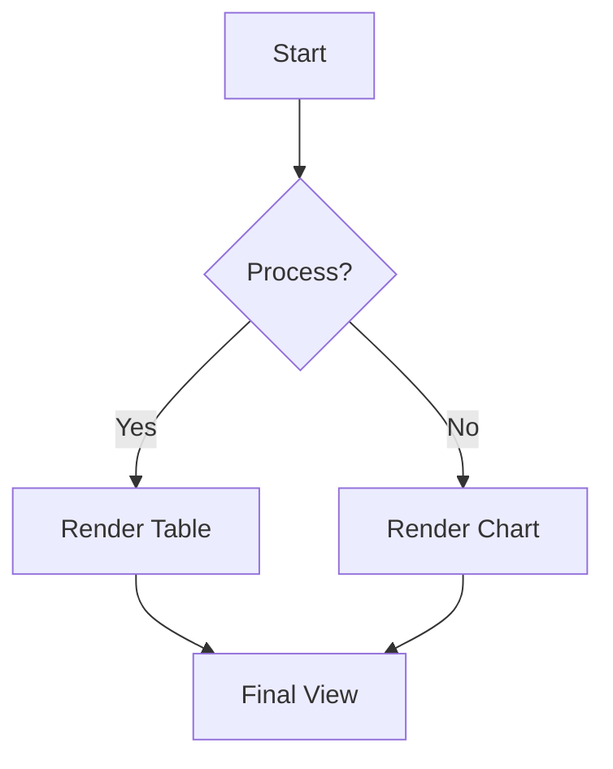
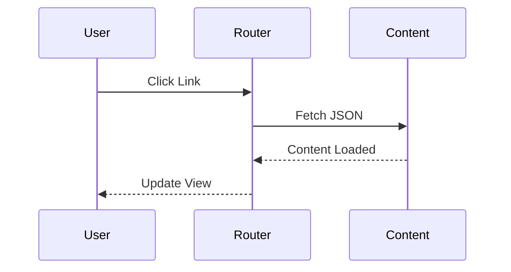

+++
title = 'Comprehensive Feature Showcase'
date = 2026-05-15T12:00:00+08:00
draft = false
tags = ['showcase', 'typography', 'ui', 'markdown']
image = 'https://images.unsplash.com/photo-1618005182384-a83a8bd57fbe?auto=format&fit=crop&q=80&w=2000'
+++

This post is the comprehensive demonstration of the **Slotify** theme's design
system and Markdown rendering. As the newest post it sits at the top of the home
feed; it is a standalone article (no series), so the side rails show only the
Table of Contents.

## 1. Premium Typography (Outfit & Inter)

The theme utilizes **Outfit** for headings and **Inter** for body text, ensuring high legibility and a modern, premium aesthetic.

### Heading Level 3
#### Heading Level 4
##### Heading Level 5
###### Heading Level 6

This is a standard paragraph demonstrating the Inter font family. Sed ut perspiciatis unde omnis iste natus error sit voluptatem accusantium doloremque laudantium, totam rem aperiam, eaque ipsa quae ab illo inventore veritatis et quasi architecto beatae vitae dicta sunt explicabo.

## 2. Text Formatting & Inline Elements

You can easily use **bold text**, *italic text*, and ~~strikethrough~~.
For technical writers, `inline code snippets` are styled with a distinct background to stand out from regular text.

Here is a link to the [Hugo Documentation](https://gohugo.io).

## 3. Blockquotes & Callouts

Blockquotes are styled with the theme's primary color to serve as elegant callouts or citations.

> "Design is not just what it looks like and feels like. Design is how it works."
> — Steve Jobs

## 4. Embedded Media (Images)

Embedded Markdown images are automatically enhanced with the Antigravity design system, featuring responsive scaling, 16px rounded corners, and a soft depth shadow. The image below is a **page-bundle local image** (`bryce-canyon.jpg` shipped alongside this post), demonstrating Hugo leaf-bundle resources:


## 5. Structured Data (Lists & Tables)

### Unordered List
*   **True SPA Architecture**: Zero-refresh navigation.
*   **Glassmorphism**: Premium blurred UI layers.
*   **Dark Mode**: Native semantic color scaling.

### Ordered List
1.  Initialize the Hugo project.
2.  Configure `hugo.toml` for JSON outputs.
3.  Write amazing content.

### Tables

Tables in Slotify feature a premium glassmorphic aesthetic, subtle zebra striping, and are fully responsive.

| Project Phase | Deliverable | Status | Priority | Progress |
| :--- | :--- | :--- | :--: | :--: |
| **Research** | Market Analysis | ✅ Done | High | 100% |
| **Design** | UI/UX Mockups | ✅ Done | Medium | 100% |
| **Development** | Core Engine | 🚧 In Progress | Critical | 45% |
| **Deployment** | Production Push | ⏳ Pending | High | 0% |

> [!TIP]
> Tables automatically trigger horizontal scrolling on mobile devices to protect the layout's integrity.

## 6. Code Blocks

Slotify provides clear, refined syntax highlighting for various programming languages, ensuring technical content is easy to digest.

### JavaScript
```javascript
// Dynamic theme detection snippet
const isDark = () => document.documentElement.classList.contains('v-theme--dark');
console.log(`Current theme: ${isDark() ? 'Dark' : 'Light'}`);
```

### Python
```python
def fibonacci(n):
    """Generate a fibonacci sequence."""
    a, b = 0, 1
    for _ in range(n):
        yield a
        a, b = b, a + b

print(list(fibonacci(5)))
```

> [!TIP]
> Fenced code blocks support line numbers and highlighting specific lines via Hugo's standard attributes.

## 7. Mermaid Diagrams

The Slotify theme provides native, SPA-compatible support for Mermaid diagrams, ensuring high-quality visualizations that respect theme mode changes.

### 7.1 Flowcharts


### 7.2 Sequence Diagrams


## 8. Mathematical Typesetting (KaTeX)

The Slotify theme provides native, zero-dependency offline math typesetting via KaTeX. Formulas are extracted from Goldmark passthrough delimiters and hydrated lazily on-demand without any overhead on pages that do not use math.

### 8.1 Inline Formulas

Inline formulas can be written using single dollar delimiters `$..$` or LaTeX notation `\(..\)`. For instance, Euler's identity is $e^{i\pi} + 1 = 0$, Einstein's mass-energy equivalence is $E = mc^2$, and the standard normal distribution density is given by $f(x) = \frac{1}{\sigma \sqrt{2\pi}} e^{-\frac{1}{2}\left(\frac{x-\mu}{\sigma}\right)^2}$.

### 8.2 Block & Display Formulas

Display math can be rendered using double dollar delimiters `$$..$$` or LaTeX block notation `\[..\]`:

$$
\int_{-\infty}^{\infty} e^{-x^2} dx = \sqrt{\pi}
$$

Matrices and multi-line equations are also fully supported:

$$
\mathbf{X} = \begin{pmatrix}
x_{11} & x_{12} & \cdots & x_{1n} \\
x_{21} & x_{22} & \cdots & x_{2n} \\
\vdots & \vdots & \ddots & \vdots \\
x_{m1} & x_{m2} & \cdots & x_{mn}
\end{pmatrix}
$$

## 9. Slotify Slots (Extensibility)

Every region of the theme is an overridable **slot** — customize any part from
your site root without forking. This very page renders through slots: the Table
of Contents (`postView/right`) and the comments area (`postView/bottom`) are slot
defaults. Add a slot override by dropping a partial at the matching path:

```html
<!-- layouts/partials/slots/postView/contentTop.html -->
<script type="application/json" data-slotify-i18n="Slotify.slots.postView.contentTop">
{ "en": { "note": "Reference only." }, "zh": { "note": "僅供參考。" } }
</script>
<script type="text/x-template" id="slot-postView-contentTop-template">
  <v-alert type="warning" variant="tonal" class="mb-6" :text="ctx.t('note')"></v-alert>
</script>
```

Each slot receives a **`ctx`** — `{ siteConfig, route, theme, t, …local }` (semantic
values, never framework internals) — and carries its own namespaced i18n. For
imperative widgets the theme broadcasts a small family of **`slotify:*` window
events**: `slotify:slot` (mount/update/unmount), `slotify:theme` (light–dark +
personality), `slotify:locale` (UI language), `slotify:route` (SPA navigation), and
`slotify:ready` (SPA interactive). This page shows both ends of that contract:

- the **comments** slot (`postView/bottom`) re-inits per article on `slotify:slot`
  and re-themes live on `slotify:theme`;
- a **global** analytics demo in `slots/head.html` logs `slotify:ready` /
  `slotify:route` / `slotify:locale` — open your browser console to watch a
  persistent, non-remounting widget react;
- a **side-rail** widget (`homeView/right`, visible on the home page on large
  screens) — a directional slot rendered in the rail gutter ContentShell always
  reserves on `lg`+ (hidden on smaller screens); an empty rail simply renders
  nothing in that reserved space.

Full contract and the build-time-vs-runtime boundary: **GUIDE § 4.4 / § 13**.

---

*This showcase is continuously updated as new features land in the Slotify theme.*
